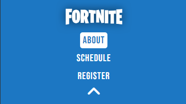

# Fortnite Tournament

The Fortnite Tournament website is for gamers from all around the world looking to compete in global online tournaments for money. The site hosts 3 pages that contain all the information they need about the tournaments. The main page contains the about section, this includes information about the tournament. The second page the schedule page, this holds information regarding the date and times of the upcoming tournaments. Lastly, the register form page, this page is for those who have been sold on the tournament and are ready to sign up.

## Features

- ### Header
   
In the header section there are 2 subsections, the Fortnite logo and the navigation links. On mobile, the logo and navigation links       appear vertically, there is a down arrow that when toggled will open the navigation links. These are links to the other pages:            About, Schedule and Register. On larger screens the toggle options are removed and the navigation links now appear horizontally to        the logo.

      
- ### About
- 
The about page has 2 sections: the banner and the information section. The banner is a large image that covers the full width of          the screen with a text box containing a slogan for the website. The information section holds details about the what the tournament       is, where it can be viewed and what the rewards are.

      
- ### Schedule
  
The schedule page has a background image with a table in the forefront. This table contains key information about the tournament          schedule such as, the dates and times of each tournament and what the format of each tournament will be: Solos, Duos, Trios and           Squads.

      
- ### Form

The register page includes a signup form where the user can input their User ID, email and tournament format of choice. Depending         on the selected format, additional input boxes will appear for extra User IDs. Once all necessary boxes are filled and the submit         button is entered, the user should be redirected to a website that confirms all details were inputted correctly.
 

  
-  ### Footer
  
The footer section appears at the bottom on all pages with 2 separate sections, social links and page links. The social links will        open pages on a new tab to their respective platform and the page links work the same as the navigation links. They appear vertically     on phones and tablets whilst displaying horizontally on laptons and larger.
   

- ## Testing

-- This project works on multiple browers, including but not limited to, Google Chrome and Mozilla Firefox.

-- All sections this project are all clearly visable and easy to navigate through.

-- All buttons and links work as intended.

-- The form only accepts User IDs between 4 and 15 characters and valid emails.

-- The website is responsive, everything functions as intended regardless of screen size.
    
## Bugs
    
When building the form element, I encountered an issue with the User IDs, if the solo format is selected, the user could not submit       their form because the other User IDs were required inputs. To hotfix this issue, I removed the required attribute to all additional      User ID inputs. However this allows the user to select any format and submit their form without entering the input fields.

## Validation:
- The HTML validator returned 0 errors

-The CSS validator returned 0 errors

-These are the scores lighthouse returned

Deployment:

Credit:

Media
